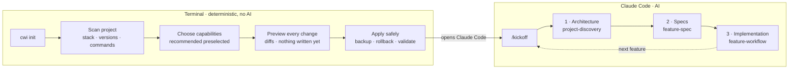

# Claude Workspace Init (CWI)

**Set up Claude Code for any project in one command. Then let Claude work in the right order: architecture, specs, implementation.**

> Start with everything available. Finish with only what the project needs.


CWI ships a **catalog** of Claude Code capabilities: skills, agents, hooks, scripts and MCP servers. `cwi init` scans your project and recommends what fits. It shows you every change before writing anything and installs only what you choose. The result is a lean workspace, with no copy of the full catalog.

Then, inside Claude Code, **`/kickoff`** takes over. It checks the project state and guides you step by step: define the architecture, write the feature specs, then implement them.

📘 **Step-by-step guide: [USAGE.md](USAGE.md)**

---

## How it works



| Phase | Tool | What you get |
| --- | --- | --- |
| **Provision** | `cwi init` (CLI) | `AGENTS.md` + `CLAUDE.md`, a `docs/` skeleton, and the skills, agents, hooks and MCP servers you selected. |
| **Architecture** | `/kickoff` → `project-discovery` | `docs/architecture.md` written from your code or your requirements, a glossary, decisions, an optional diagram. |
| **Specs** | `/kickoff` → `feature-spec` | `docs/specs/<feature>.md` with testable acceptance criteria and open questions. |
| **Build** | `/kickoff` → `feature-workflow` | Branch, plan, test-first slices, verification, independent review, PR description. |

---

## Quick start

### 1. Install once

You need [uv](https://docs.astral.sh/uv/) and Python 3.12 or newer.

```bash
git clone https://github.com/pol5coma/claude-workspace-init ~/tools/claude-workspace-init
uv tool install -e ~/tools/claude-workspace-init
cwi --version
```

### 2a. Add it to a project you already have

```bash
cd my-project
cwi init --catalog ~/tools/claude-workspace-init/catalog --dry-run   # preview only
cwi init --catalog ~/tools/claude-workspace-init/catalog              # do it
```

### 2b. Or start a new project from this template

```bash
git clone https://github.com/pol5coma/claude-workspace-init my-app
cd my-app
cwi init        # removes CWI's own files after a successful run
```

### 3. Start working in Claude Code

```bash
claude "/kickoff"
```

When `cwi init` finishes, it offers to open Claude Code with `/kickoff` already started.

---

## What ends up in your project

```text
my-project/
├── AGENTS.md            shared instructions for every coding agent: safety, stack + versions, commands, docs
├── CLAUDE.md            @AGENTS.md  ← Claude Code imports the shared file; add Claude-only notes below
├── docs/
│   ├── architecture.md  structure, data flow, integrations, "Stack & versions" table
│   ├── domain/glossary.md
│   ├── specs/           one spec per feature + ordered backlog in README.md
│   ├── decisions/       short design decision records
│   └── diagrams/        archify diagrams (created when you ask for one)
├── .mcp.json            only if you picked an MCP server (secrets as ${VAR})
├── scripts/             only if you picked a project script
└── .claude/
    ├── settings.json    hooks (safety-guard, post-edit-validation)
    ├── skills/          only the selected skills
    ├── agents/          only the selected agents (+ development-agents/)
    ├── hooks/           hook scripts
    └── cwi-state.json   what CWI installed (paths, owners, hashes; never secrets)
```

Claude Code finds all of it automatically the next time you open the project. You can check with `/agents`, `/hooks`, `/mcp` and `/memory`, or type `/` to list the skills.

---

## Highlights

| | |
| --- | --- |
| 🔍 **Detect before asking** | Reads manifests and lockfiles only, and never runs project code. Finds languages, frameworks, **exact versions**, databases, infrastructure, test tools and commands, each with its evidence. |
| 🧭 **Recommend, don't impose** | Deterministic recommendations by project type and technology, with the reason shown. You decide. |
| 👀 **Show before changing** | A full plan and diffs of every existing file before anything is written. Cancel means zero changes. |
| 🛟 **Never destroy your work** | Transactional apply with backup and rollback. Existing `CLAUDE.md`, settings and MCP config are merged, never overwritten. CWI only removes what it installed. |
| 🔁 **Idempotent** | Running it twice with the same answers changes nothing. Files you edited are detected by hash and never replaced silently. |
| 🤝 **Works with every agent** | `AGENTS.md` (the [agents.md](https://agents.md) standard) holds the shared instructions. `CLAUDE.md` imports it. |
| 🛡️ **Safety Guard** | A hook that blocks destructive commands such as `terraform destroy`, `prisma migrate reset`, `git push --force` or `rm -rf /`, and edits to `.env` or keys, before they run. |
| 📌 **Version-pinned** | The stack in `AGENTS.md` lists the real versions and tells agents to code for them. |

---

## The catalog

Items marked ⭐ are preselected in every project. The others are recommended according to the project type or the technologies detected, and you can always change the selection.

### Workflow skills: the `/kickoff` path

| Skill | What it does |
| --- | --- |
| ⭐ `kickoff` | The entry point in Claude Code. It reads the project state and runs the next step in order: architecture, then specs, then implementation. Resumable. |
| ⭐ `project-discovery` | Defines the architecture. It finds an existing one, analyzes the code with `codebase-explorer`, or builds one from your requirements documents. |
| `feature-spec` | Turns a request into `docs/specs/<feature>.md`: acceptance criteria (Given / When / Then), edge cases, open questions. Never invents business rules. |
| `feature-workflow` | Implements a feature from its spec: branch, plan, test-first slices with small commits, verification, independent review, PR. It always asks when something is unclear. |
| ⭐ `archify` | Interactive HTML diagrams of architecture, workflows, sequences, dataflows and lifecycles, from requirements or from the code. Needs Node.js 18+. |

### Engineering skills

| Skill | What it does |
| --- | --- |
| `testing` | Runs the smallest relevant test scope first. Includes a related-test finder. |
| `debugging` | Reproduce, isolate, hypothesize, fix, add a regression test. |
| `backend-development` | API, validation, persistence and migration conventions, with FastAPI, Django and Express references. |
| `frontend-development` | Components, state, forms, accessibility and styling, with React, Next.js, Vue and Svelte references. |

### Agents

| Agent | What it does |
| --- | --- |
| `code-reviewer` | Reviews the diff for correctness and tests, and runs the project's quality checks (read-only). |
| `security-reviewer` | Finds injection, authorization, secrets and unsafe-dependency issues. Includes an offline dependency inventory (read-only). |
| **`development-agents/`** (35) | A family of development, maintenance, review and testing agents. Each project type preselects a subset. [Full list in USAGE.md](USAGE.md#the-development-agents-family). |

### Hooks, scripts and MCP

| Capability | What it does |
| --- | --- |
| ⭐ `safety-guard` (hook) | Blocks clearly destructive commands and edits to protected files before they run. It parses commands, so `echo "terraform destroy"` is allowed. |
| ⭐ `post-edit-validation` (hook) | After each edit, formats and lints **only that file** with the project's own tools. It never installs anything. |
| `run-quality-checks` (script) | Runs only the linters, type checkers and tests the project is configured for. |
| `github` (MCP) | GitHub's remote MCP server: issues, pull requests, code search and Actions. Needs `GITHUB_TOKEN`. |

Add your own with `cwi catalog add`. See [USAGE.md › Add to the catalog](USAGE.md#4-add-things-to-the-catalog).

---

## Credits and sources

CWI builds on great open-source work. Every third-party component keeps its license notice.

| Component | Source | License | What CWI changed |
| --- | --- | --- | --- |
| `archify` skill | [tt-a1i/archify](https://github.com/tt-a1i/archify) v3.0.1, based on [Cocoon-AI/architecture-diagram-generator](https://github.com/Cocoon-AI/architecture-diagram-generator) | MIT | Bundled unchanged, except the `test/` folder. `LICENSE` and `THIRD_PARTY_NOTICES.md` are included. |
| `development-agents/` family (35 agents) | [davila7/claude-code-templates](https://github.com/davila7/claude-code-templates), [`cli-tool/components/agents/development-tools`](https://github.com/davila7/claude-code-templates/tree/main/cli-tool/components/agents/development-tools) | MIT, © 2025 Daniel (San) Ávila | Reviewers made read-only, non-Claude Code tool names translated, invalid models fixed, `code-reviewer` renamed `senior-code-reviewer`. Each file carries an attribution comment. |
| `github` MCP server | [github/github-mcp-server](https://github.com/github/github-mcp-server), remote endpoint `api.githubcopilot.com/mcp/` | MIT | Configuration only. The token is a `${GITHUB_TOKEN}` reference. |
| `AGENTS.md` format | [agents.md](https://agents.md) open standard | n/a | CWI generates it and imports it from `CLAUDE.md`. |

Written for CWI: the `kickoff`, `project-discovery`, `feature-spec`, `feature-workflow`, `testing`, `debugging`, `backend-development` and `frontend-development` skills, the `code-reviewer` and `security-reviewer` agents, the `safety-guard` and `post-edit-validation` hooks, the `run-quality-checks` script, and the `cwi` CLI.

Built on the Claude Code project conventions for [skills](https://code.claude.com/docs/en/skills), [subagents](https://code.claude.com/docs/en/sub-agents), [hooks](https://code.claude.com/docs/en/hooks), [MCP](https://code.claude.com/docs/en/mcp) and [memory / AGENTS.md](https://code.claude.com/docs/en/memory).

---

## Development

```bash
uv sync
uv run pytest                                       # unit, integration and end-to-end tests
uv run ruff check . && uv run ruff format --check .
uv run cwi catalog validate
uv run cwi init --dry-run
```

```text
src/cwi/
├── scanner/     reads the project (never prints, never executes project code)
├── catalog/     loads, validates and recommends capabilities
├── claude_md/   renders AGENTS.md / CLAUDE.md and the docs skeleton
├── planning/    builds the full plan (never prompts, never writes)
├── install/     applies the plan transactionally (never decides)
├── authoring/   `cwi catalog add`
├── ui/          screens and prompts
└── paths.py     every Claude Code path contract in one place
```
