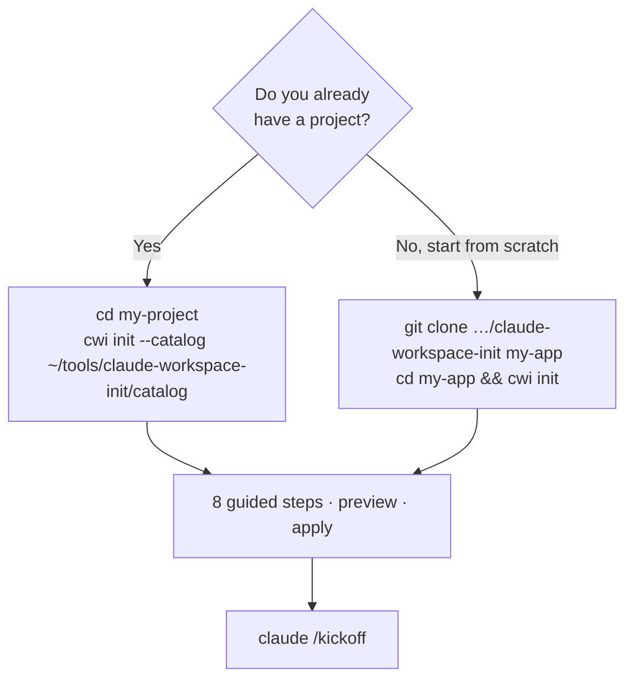
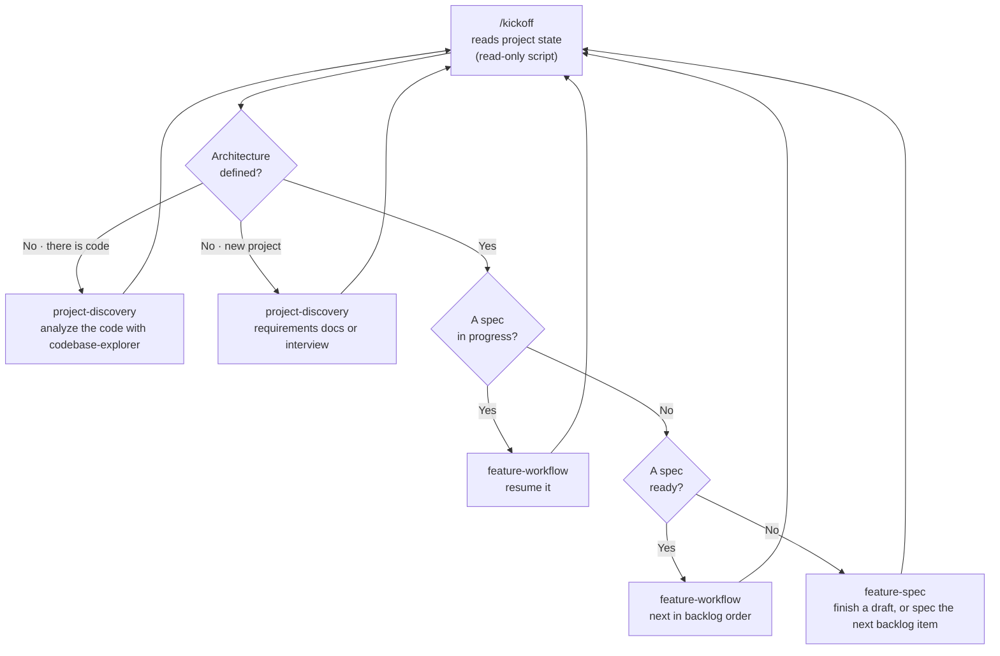
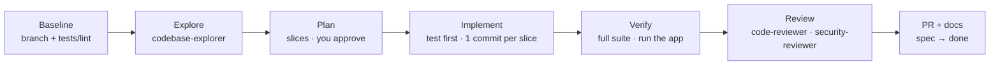
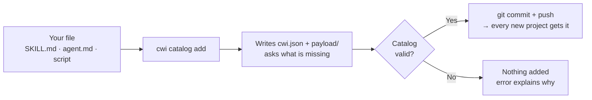

# Using CWI

A complete, step-by-step guide. For the overview, see the [README](README.MD).

**Contents**

1. [Install CWI](#1-install-cwi): once per machine
2. [Set up a project](#2-set-up-a-project): `cwi init`
3. [Work in Claude Code](#3-work-in-claude-code-kickoff): `/kickoff`
4. [Add things to the catalog](#4-add-things-to-the-catalog): for maintainers of this template
5. [Reference](#5-reference): the catalog in detail, what gets preselected, the Safety Guard rules
6. [Troubleshooting](#6-troubleshooting)

---

## 1. Install CWI

You need:

| Requirement | Why | Check |
| --- | --- | --- |
| [uv](https://docs.astral.sh/uv/) | Installs and runs the `cwi` CLI | `uv --version` |
| Python 3.12+ | CWI is written in Python. uv can provide it. | `python3 --version` |
| [Claude Code](https://code.claude.com) | Where the workspace is used | `claude --version` |
| Node.js 18+ *(optional)* | Only for the `archify` diagram skill | `node --version` |

```bash
git clone https://github.com/pol5coma/claude-workspace-init ~/tools/claude-workspace-init
uv tool install -e ~/tools/claude-workspace-init
cwi --version          # cwi 0.1.0
```

> **Why install it as a tool?** CWI's catalog stays in its own folder, and every project points to it. When you start a project *from the template*, CWI deletes its own source from that project. The installed `cwi` command keeps working.

To update CWI later, run `git -C ~/tools/claude-workspace-init pull`. The editable install picks up the change.

---

## 2. Set up a project



### Option A: a project you already have

The catalog is **not copied** into your project. Only what you select is installed.

```bash
cd ~/projects/my-project
git status                                                   # commit first, so `git diff` shows what CWI added
cwi init --catalog ~/tools/claude-workspace-init/catalog --dry-run   # see the plan, write nothing
cwi init --catalog ~/tools/claude-workspace-init/catalog              # run it
```

### Option B: a new project from the template

```bash
git clone https://github.com/pol5coma/claude-workspace-init my-app
cd my-app
mkdir -p docs/requirements && cp ~/somewhere/*.md docs/requirements/   # optional: your requirements
cwi init
```

After a successful run CWI removes its own files: `catalog/`, `templates/`, `src/cwi/`, `tests/`, `pyproject.toml`, `uv.lock`, `.python-version`, `USAGE.md`, the spec docs and the template marker. Only your workspace remains.

### The 8 steps

Press **Enter** to accept the suggestion on any screen. **Space** toggles items in a list.

| Step | What you see | What to do |
| --- | --- | --- |
| **1 · Workspace** | The project folder. If you run CWI inside a git subfolder, it asks which root to use. Shows a notice if you have uncommitted changes. | Confirm |
| **2 · Scan** | Reads manifests and lockfiles. It never runs your code. | Nothing |
| **3 · Project profile** | **Existing project:** the detected type and stack with versions, for example "Full-stack · Python 3.12 · FastAPI 0.115 · React 19.0". **New project:** a few questions about what you are building, languages, frameworks, database, testing and infrastructure. | **Confirm**, **Edit**, **View evidence** (why each item was detected) or **Rescan** |
| **4 · Instructions & docs** | Where instructions live: **AGENTS.md + CLAUDE.md** (recommended) or **CLAUDE.md only**. Then the safety rules, the essential commands, the docs skeleton and any extra global instruction. Shows the size of the result. | Accept, or edit commands and the list of protected commands |
| **5 · Capabilities** | Five lists: Skills, Agents (grouped by family), Scripts, MCP, Hooks. Recommended items are ticked, and each shows **why**. | Tick or untick. Dependencies and conflicts are asked about. |
| **6 · Review plan** | Every file to create, update or delete, and any warnings. Required tokens, such as `GITHUB_TOKEN`, and missing tools, such as `node`, are listed here. | **Apply**, **Review changes** (diffs), **Show all operations**, **Back** or **Cancel** |
| **7 · Apply** | Progress such as "Applying 12/25 · .claude/agents/…". Writes are transactional: if anything fails, everything is rolled back. | Wait |
| **8 · Next steps** | The order to work in, and the exact command. | Accept **"Open Claude Code now and start kickoff?"** |

Nothing is written before **Apply**. **Cancel** leaves the project exactly as it was.

### Existing files are safe

| You already have | What CWI does |
| --- | --- |
| `CLAUDE.md` | Adds `@AGENTS.md` at the top and keeps everything else. Sections you already have are not repeated in `AGENTS.md`. |
| `AGENTS.md` | Asks: **keep**, **merge** (adds only missing sections), **replace** or **skip**. **Show diff** is always available. |
| `.claude/settings.json` | Merges the hooks. Your permissions, env and other hooks stay. |
| `.mcp.json` | Adds new servers. A server with the same name and a different config asks: keep or replace. |
| A file CWI wants to install, such as `.claude/agents/x.md` | Asks: keep yours or replace it. |
| `docs/architecture.md` or other docs | Never touched. Only missing docs are created. |

### Flags

| Command | Use it to |
| --- | --- |
| `cwi init --dry-run` | See the full plan. Writes nothing. |
| `cwi init --yes` | Accept every default with no questions. Good for scripts. |
| `cwi init --catalog PATH` | Use a catalog outside the project. You need this for existing projects. |
| `cwi init --root PATH` | Set up another folder. |
| `cwi init --verbose` | Show debug logs and tracebacks. |

### Running `cwi init` again

Run it whenever you want to:

- **Change the selection.** Untick a capability and CWI removes **only the files it installed** for it. A file you edited is never deleted without asking.
- **Refresh the instructions.** Choose **Rescan** on the profile screen to update the stack and versions after an upgrade.
- **Check the workspace.** CWI warns about any of its files you edited since installing.

With the same answers, a rerun changes nothing ("Workspace already up to date").

---

## 3. Work in Claude Code: `/kickoff`

`cwi init` only provisions the workspace and runs no AI. The work happens in Claude Code, and **`/kickoff`** is the single entry point:

```bash
claude "/kickoff"
```

### What `/kickoff` does



1. **Reads the state** with a read-only script: the architecture (missing, template or defined), whether there is code, requirement documents, specs with their status and open questions, the backlog and existing diagrams.
2. **Shows a short status** and **proposes the next step**. Nothing starts without your OK.
3. **Runs that step** by delegating to the right skill, then checks the state again and proposes the next one.

It is **resumable**. The state lives in the files, in each spec's `Status:` line and the `## Backlog` list, so running `/kickoff` tomorrow continues where you stopped.

> **Order is enforced.** Until the architecture is written, `docs/architecture.md` keeps a `cwi:architecture-template` marker. `feature-spec` and `feature-workflow` refuse to start while it is there.

### Step 1: architecture with `project-discovery`

It starts by asking **"Is the architecture already defined?"**

| Your answer | What happens |
| --- | --- |
| **Yes, here is the path** | Uses that document and links it from `AGENTS.md`. |
| **Yes, find it** | Searches `ARCHITECTURE.md`, `docs/**/architecture*`, ADR folders and README sections, then you confirm which one. |
| **No, there is code** | Delegates to `codebase-explorer`. Fills `docs/architecture.md` (overview, structure, data flow, integrations, conventions), checks versions against the lockfiles, seeds the glossary and lists implicit decisions. |
| **No, new project** | Uses your requirements, for example `docs/requirements/`, PRD or brief files, or interviews you. Writes the glossary, a proposed architecture, `docs/decisions/0001-stack.md` and an ordered backlog that starts with `project-setup`. |

Every contradiction or gap becomes a question for you. It never invents business rules. At the end it offers an **architecture diagram** made with archify.

### Step 2: specs with `feature-spec`

Turns a feature into `docs/specs/<feature>.md`, based on `docs/specs/_template.md`:

```markdown
# Checkout
Status: ready

## Goal
## User stories
## Acceptance criteria        ← Given / When / Then, each one testable
## Edge cases
## Out of scope
## Data and API changes
## Open questions             ← unknowns go here, never into the criteria
```

It asks clarifying questions first, and marks the spec `ready` only when you agree.

### Step 3: build with `feature-workflow`



**Ask, don't assume.** It stops and asks whenever:
- a requirement is unclear, ambiguous or contradictory;
- an important decision is missing (data model, public API, security, a new dependency, UX behaviour);
- the spec and the code disagree;
- the plan must change.

It never commits to `main`, never force-pushes, and asks before anything destructive. After `project-setup` or an upgrade, it reminds you to run `cwi init` → **Rescan** so the stack versions in `AGENTS.md` stay accurate.

You can also call any of these skills directly: `/project-discovery`, `/feature-spec`, `/feature-workflow`.

### Diagrams with `archify`

Installed by default. It needs Node.js 18+, and CWI warns you if `node` is missing. The workflow skills offer it, and it is never required:

| When | Skill | Diagram |
| --- | --- | --- |
| The architecture is written | `project-discovery` | Architecture, from the real code |
| The architecture exists but has no diagram yet | `kickoff` | Architecture (offered once) |
| A feature has a non-trivial flow | `feature-spec` | Workflow, sequence, dataflow or lifecycle |
| A feature changed the structure | `feature-workflow` | Refreshed architecture, linked in the PR |

Diagrams are saved in `docs/diagrams/<type>-<slug>/` and versioned with your docs. You can also ask at any time, for example "make a sequence diagram of the login flow". To use archify outside CWI in every project, link a global install: `ln -s ~/.agents/skills/archify ~/.claude/skills/archify`.

### `AGENTS.md`, `CLAUDE.md` and versions

`AGENTS.md` is the [open standard](https://agents.md) read by Codex, Cursor, Gemini CLI, GitHub Copilot and Claude Code. Claude Code ignores it when a `CLAUDE.md` exists, so CWI writes a `CLAUDE.md` whose first line imports it:

```markdown
@AGENTS.md

<!-- Shared instructions for every coding agent live in AGENTS.md.
     Add Claude Code-specific notes below this line. -->
```

A generated `AGENTS.md` looks like this:

```markdown
## Safety
Never perform destructive database operations … without explicit user approval.
Commands that always require explicit approval: `git push --force`, `git reset --hard`, `rm -rf`.

## Stack
Frontend:
- TypeScript 5.5
- React 18.3
- Vite 5.4

Write code for these versions. When an API differs between versions, check the official
documentation for the version in use; never introduce APIs from another major version.

## Commands
- Run: `npm run dev`
- Test: `npm test`

## Project docs
- Architecture and versions: `docs/architecture.md`. Read it before structural changes.
- Business vocabulary: `docs/domain/glossary.md`.
- Feature specs: `docs/specs/`. Read the spec before implementing a feature; if there is none, write one first.
- Decisions: `docs/decisions/`. Record significant design decisions there.
```

Versions come from the lockfiles (`package-lock.json`, `pnpm-lock.yaml`, `yarn.lock`, `uv.lock`, `poetry.lock`). A loose range such as `>=0.115` shows no version, because it would be a guess.

### Hooks you get by default

| Hook | When | What it does |
| --- | --- | --- |
| `safety-guard` | Before every Bash command and file edit | Blocks clearly destructive operations and protected files. Claude gets the reason and asks you. [Rules](#safety-guard-rules) |
| `post-edit-validation` | After every file edit | Formats and lints **only the edited file** with the project's own tools (Ruff, Prettier, ESLint, gofmt, rustfmt), and sends problems back to Claude. It skips tools that are not configured. |

### MCP tokens

Some MCP servers need a token. CWI lists them in step 6. Set them in your shell, never in the repo:

```bash
export GITHUB_TOKEN=ghp_...
```

`.mcp.json` only stores the reference `${GITHUB_TOKEN}`. The first time, Claude Code asks you to approve the project's MCP servers.

### Check what Claude Code loaded

| Command in Claude Code | Shows |
| --- | --- |
| `/agents` | Installed agents, including `development-agents/` |
| `/` | Skills such as `/kickoff`, `/archify`, `/feature-spec` |
| `/hooks` | `safety-guard`, `post-edit-validation` |
| `/mcp` | MCP servers and their status |
| `/memory` | `CLAUDE.md` with the `AGENTS.md` import |

If Claude Code was already open while `cwi init` ran, restart it so it sees the new agents.

---

## 4. Add things to the catalog

For maintainers of this template. Run these commands from the repository root with `uv run cwi …`, or `cwi …` if it is installed.



### What to pass for each type

| Type | You pass | Extras | Where tools go |
| --- | --- | --- | --- |
| **Skill** | `SKILL.md`, or a folder containing it | `--ref file.md` → `references/`, `--script file` → `scripts/`, `--exclude test` | `allowed-tools:` in the frontmatter |
| **Agent** | One `.md` file | `--script file` → `.claude/scripts/<id>/` | `tools:` and `model:` in the frontmatter |
| **Hook** | The hook script | `--event`, `--matcher`, `--timeout` | n/a |
| **Script** | The script file(s) | `--description` (required) | n/a |
| **MCP** | The server name | `--url` + `--header K=V`, or `--command` + `--arg`, and `--env VAR` | Secrets always as `${VAR}` |

<details>
<summary><b>Skill example</b></summary>

```markdown
---
name: api-design
description: REST API design rules. Use when adding or changing endpoints.
allowed-tools: Read, Grep
---

# API design
…instructions for Claude…
```

```bash
cwi catalog add skill path/to/SKILL.md
cwi catalog add skill path/to/SKILL.md --ref rest-guide.md --script check.py
cwi catalog add skill path/to/api-design/                # whole folder
cwi catalog add skill ~/.agents/skills/archify --exclude test --default
```
</details>

<details>
<summary><b>Agent example</b></summary>

```markdown
---
name: dba
description: Reviews SQL and migrations. Use before merging database changes.
tools: Read, Grep, Bash
model: sonnet
---

You are a database reviewer…
```

```bash
cwi catalog add agent path/to/dba.md
cwi catalog add agent path/to/dba.md --script explain-query.py --depends script:run-quality-checks
```

If you run `add skill` on a file whose frontmatter has `tools:`, CWI tells you it is an agent.

A custom tool for an agent, such as a script that queries a database, is shipped with `--script`. The agent runs it through `Bash`. For a real tool, add an MCP server and make the agent `--depends mcp:<name>`.
</details>

<details>
<summary><b>Hook example</b></summary>

A hook receives the event JSON on stdin. Exit code `2` blocks the action, and stderr is shown to Claude as the reason.

```bash
cwi catalog add hook block-prod.sh --event PreToolUse --matcher Bash -d "Blocks production deploys"
cwi catalog add hook notify.py --event Stop -d "Desktop notification when Claude finishes"
```

Events: `PreToolUse`, `PostToolUse`, `UserPromptSubmit`, `Stop`, `SubagentStop`, `SessionStart`, `SessionEnd`, `Notification`, `PreCompact`. `--matcher` applies only to `PreToolUse` and `PostToolUse`.
</details>

<details>
<summary><b>Script and MCP examples</b></summary>

```bash
cwi catalog add script seed-db.sh -d "Seeds the local database with demo data"

cwi catalog add mcp linear --url https://mcp.linear.app/mcp \
  --header 'Authorization=Bearer ${LINEAR_TOKEN}'

cwi catalog add mcp postgres --command npx \
  --arg -y --arg @modelcontextprotocol/server-postgres --arg '${DATABASE_URL}'
```

A real token in `--header` or `--env` is rejected: "looks like a literal secret".
</details>

### When is it ticked in `cwi init`?

| Option | Effect |
| --- | --- |
| `--default` | Ticked in every project. |
| `--type backend,fullstack` | Ticked for those project types: `backend`, `frontend`, `fullstack`, `ai`, `cli`, `library`, `data_ml`, `other`. |
| `--tech fastapi,react` | Ticked when those technologies are detected. |
| `--group <family> --group-default backend` | Ticked for that project type through its family. |
| *(nothing)* | Listed, and the user ticks it manually. |
| `--depends type:id` | Installs that capability too whenever this one is selected. |

Without `--yes`, the command asks you these questions.

### Families

A family groups related capabilities in one folder, and decides which members are ticked for each project type.

```text
catalog/agents/development-agents/
├── group.json               name + defaults per project type
├── debugger/
│   ├── cwi.json
│   └── payload/.claude/agents/development-agents/debugger.md
└── …
```

Grouped agents install into `.claude/agents/<family>/`, and Claude Code finds agents in subfolders.

```bash
cwi catalog add agent terraform-expert.md --group devops-agents --group-default backend,fullstack
cwi catalog group create agent product-agents --name "Product agents"
cwi catalog group defaults agent development-agents backend debugger,test-automator,refactoring-specialist
```

### Other catalog commands

```bash
cwi catalog list                       # everything, with group, defaults and recommendations
cwi catalog validate                   # check the whole catalog
cwi catalog remove skill:old           # remove an entry (also from its family defaults)
cwi catalog add skill SKILL.md --force # replace an existing entry
```

### Publish

The commands only change files under `catalog/`. Ship them like any other change:

```bash
git add catalog/ && git commit -m "catalog: add api-design skill" && git push
```

Every project set up after the push can use the new capability.

---

## 5. Reference

### What gets preselected

✓ means preselected. Everything can be changed on the capabilities screen.

| Capability | backend | frontend | fullstack | ai | cli | library | data_ml | other |
| --- | :-: | :-: | :-: | :-: | :-: | :-: | :-: | :-: |
| `kickoff`, `project-discovery`, `archify` | ✓ | ✓ | ✓ | ✓ | ✓ | ✓ | ✓ | ✓ |
| `safety-guard`, `post-edit-validation` | ✓ | ✓ | ✓ | ✓ | ✓ | ✓ | ✓ | ✓ |
| `feature-spec`, `feature-workflow` | ✓ | ✓ | ✓ | ✓ | ✓ | ✓ | ✓ | ✓¹ |
| `testing`, `debugging`, `code-reviewer` | ✓ | ✓ | ✓ | ✓ | ✓ | ✓ | ✓ | |
| `run-quality-checks` | ✓² | ✓² | ✓² | ✓² | ✓² | ✓² | ✓² | |
| `backend-development` | ✓ | | ✓ | | | | | |
| `frontend-development` | | ✓ | ✓ | | | | | |
| `security-reviewer` | ✓ | | ✓ | ✓ | | | | |
| `github` (MCP) | ✓³ | ✓³ | ✓³ | ✓³ | ✓³ | ✓³ | ✓³ | ✓³ |

¹ Installed as dependencies of `kickoff`. ² Installed as a dependency of `code-reviewer`. ³ Only when GitHub Actions workflows are detected.

Technologies also trigger recommendations. For example, a detected FastAPI ticks `backend-development`, and a detected Vitest ticks `testing`.

### The `development-agents` family

35 agents adapted from [davila7/claude-code-templates](https://github.com/davila7/claude-code-templates/tree/main/cli-tool/components/agents/development-tools) (MIT). 🔒 means read-only: no `Write` or `Edit`.

**Preselected by project type** (from `catalog/agents/development-agents/group.json`):

| Agent | backend | frontend | fullstack | ai | cli | library | data_ml |
| --- | :-: | :-: | :-: | :-: | :-: | :-: | :-: |
| `debugger` | ✓ | ✓ | ✓ | ✓ | ✓ | ✓ | ✓ |
| `test-automator` | ✓ | ✓ | ✓ | ✓ | ✓ | ✓ | ✓ |
| `refactoring-specialist` | ✓ | ✓ | ✓ | ✓ | ✓ | ✓ | |
| `dependency-manager` | ✓ | ✓ | ✓ | | ✓ | ✓ | |
| `codebase-explorer` 🔒 | ✓ | ✓ | ✓ | ✓ | | | |
| `architect-reviewer` 🔒 | ✓ | | ✓ | ✓ | | ✓ | |
| `performance-engineer` | ✓ | ✓ | ✓ | | | | ✓ |
| `error-detective` 🔒 | ✓ | | ✓ | ✓ | | | |
| `accessibility-tester` 🔒 | | ✓ | ✓ | | | | |
| `cli-developer` | | | | | ✓ | | |
| `unused-code-cleaner` | | | | | | ✓ | |

<details>
<summary><b>All 35 agents</b></summary>

| Agent | What it does | Notes |
| --- | --- | --- |
| `accessibility-tester` 🔒 | WCAG accessibility audits | Recommended for frontend and full-stack |
| `architect-reviewer` 🔒 | Reviews design decisions and architecture | |
| `ascii-ui-mockup-generator` | ASCII mockups of UI layouts | |
| `build-engineer` | Build performance and compilation times | |
| `chaos-engineer` | Controlled failure experiments and resilience | |
| `cli-developer` | Command-line tools and terminal apps | |
| `code-simplifier` | Simplifies code without changing behaviour | |
| `codebase-explorer` 🔒 | Maps an unfamiliar codebase | Used by `project-discovery` |
| `codebase-pattern-finder` 🔒 | Finds existing patterns and examples | |
| `command-expert` | CLI command design | Written for its source repo |
| `context-manager` | Context in long multi-agent tasks | |
| `debugger` | Diagnoses and fixes bugs | |
| `dependency-manager` | Audits and updates dependencies | |
| `dx-optimizer` | Developer workflow: builds, feedback loops | |
| `error-detective` 🔒 | Correlates errors and logs | |
| `flutter-go-reviewer` 🔒 | Flutter and Go code review | Recommended when Go or Dart is detected |
| `general-purpose` | Generalist agent | ⚠️ Overrides Claude Code's built-in agent of the same name |
| `laravel-expert-agent` | Laravel development | Recommended when Laravel is detected |
| `launchdarkly-flag-cleanup` | Cleans up LaunchDarkly feature flags | Needs the LaunchDarkly MCP |
| `mcp-expert` | MCP integrations | Written for its source repo |
| `pagerduty-incident-responder` | PagerDuty incident response | Needs the PagerDuty and GitHub MCPs |
| `performance-engineer` | Finds and removes bottlenecks | |
| `performance-profiler` | Memory and latency profiling | |
| `playwright-tester` | Playwright end-to-end tests | Recommended when Playwright is detected |
| `qa-expert` | QA strategy and test plans | |
| `refactoring-specialist` | Safe refactors of complex or duplicated code | |
| `rootly-incident-responder` | Incident response with Rootly | Needs the Rootly MCP |
| `senior-code-reviewer` 🔒 | Broad code review | Originally `code-reviewer`, renamed |
| `slack-expert` | Slack apps and integrations | |
| `technical-debt-manager` 🔒 | Technical debt analysis and planning | |
| `test-automator` | Builds automated tests and frameworks | |
| `test-engineer` | Test strategy and automation | |
| `thinking-beast-mode` | Long autonomous multi-step tasks | |
| `tooling-engineer` | Internal developer tools | |
| `unused-code-cleaner` | Removes unused imports, functions and classes | |

</details>

> Each selected agent adds its description to Claude's context. If Claude Code warns that agent descriptions are too long, trim the lists in `group.json`.

### Safety Guard rules

The guard **parses** shell commands into the executable and its arguments. It handles `&&`, `;`, `|`, newlines, `sudo`, `env`, `npx`, `uv run`, `bash -c`, `eval` and `$(…)`. It blocks only clear matches:

| Area | Blocked examples |
| --- | --- |
| Infrastructure | `terraform destroy`, `terraform apply -destroy`, `pulumi destroy`, `cdk destroy`, `kubectl delete namespace`, `kubectl delete … --all`, `helm uninstall` |
| Databases | `prisma migrate reset`, `prisma db push --force-reset`, `dropdb`, `alembic downgrade base`, `manage.py flush`, `rails db:drop`, SQL `DROP` / `TRUNCATE` / `DELETE` without `WHERE`, `redis-cli FLUSHALL` |
| Containers and cloud | `docker compose down -v`, `docker volume rm`, `docker system prune --volumes`, `aws s3 rb --force`, `aws s3 rm --recursive`, RDS / DynamoDB / CloudFormation deletes |
| Git | `git push --force` (allowed with `--force-with-lease`), `git reset --hard`, `git clean -f`, `git checkout -- .`, `git stash clear` |
| Files | `rm -r` on `/`, `~`, `.`, `..`, `*`, `.git` or outside the project (temp folders allowed), `mkfs`, `dd of=/dev/…`, `shred` |
| Protected paths | Writing or editing `.env*` (not `.env.example`), `*.pem`, `*.key`, SSH keys, `.git/`, the guard itself and CWI state |

Allowed on purpose: `rm -rf node_modules`, `rm -rf ./dist`, `git push`, `terraform plan`, `prisma migrate dev`, and `echo "terraform destroy"` (just text).

Per-project overrides go in `.claude/safety-guard.json`. That file is protected, so only you can change it:

```json
{
  "protected_paths": ["config/production.yml"],
  "allow_paths": [".env.local"],
  "allow_commands": ["^terraform destroy -target=module\\.sandbox"],
  "disabled_rules": ["git-reset-hard"]
}
```

### Credits

The third-party components are listed with their sources and licenses in the [README › Credits and sources](README.MD#credits-and-sources).

---

## 6. Troubleshooting

| Problem | Fix |
| --- | --- |
| `cwi: command not found` | Run `uv tool install -e ~/tools/claude-workspace-init`, and make sure `~/.local/bin` is on your `PATH`. |
| `No CWI catalog found` | Pass `--catalog ~/tools/claude-workspace-init/catalog`, or run from the template folder. |
| `Catalog source unavailable` on a rerun | Expected after cleanup. Pass `--catalog` to add or remove capabilities. |
| `Re-run with --yes to apply` | No interactive terminal. Add `--yes`, or run it in a real terminal. |
| `… changed since the preview` | A file changed during the run. Run `cwi init` again. |
| `skill:archify needs node` | Install Node.js 18+. The skill is installed anyway. |
| Agents missing in Claude Code | Restart Claude Code, then check `/agents`. |
| The MCP server does not connect | Export its token, for example `GITHUB_TOKEN`, then approve the server in `/mcp`. |
| `/kickoff` keeps proposing discovery | `docs/architecture.md` still has the `cwi:architecture-template` line. Finish discovery, or remove the line. |
| The Safety Guard blocked something you need | Run it yourself, or allow it in `.claude/safety-guard.json`. |
| `The id '…' is already used` | Ids are unique across all types. Pass `--id another-name`. |
| `looks like a literal secret` | Replace the token with `${VAR_NAME}`. |
| Anything else | Run the same command with `--verbose`. |
